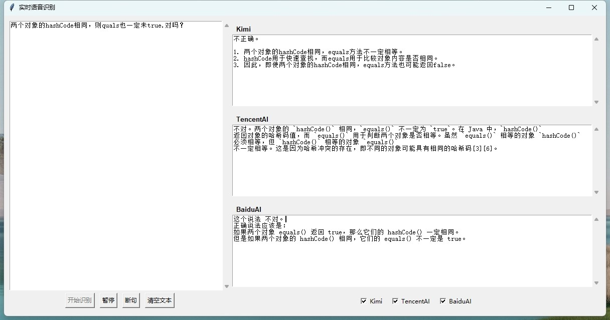

# 面试辅助系统

[English](README.md)



## 概述
面试辅助系统是一个基于AI的工具，可以将面试官的音频实时转换为文字，并提供合适的回答。系统集成了包括百度、腾讯和Kimi在内的多个AI服务，以获得最佳性能。

## 项目地址
GitHub: [https://github.com/RiceRound/AI_Interview](https://github.com/RiceRound/AI_Interview)

## AI 服务地址
- 腾讯云 AI: [https://lke.cloud.tencent.com/lke#/app/home](https://lke.cloud.tencent.com/lke#/app/home)
- 百度智能云千帆: [https://qianfan.cloud.baidu.com/appbuilder/](https://qianfan.cloud.baidu.com/appbuilder/)
- Kimi AI: [https://platform.moonshot.cn/](https://platform.moonshot.cn/)
- ChatGPT: [https://platform.openai.com/](https://platform.openai.com/)
- Claude: [https://claude.ai/](https://claude.ai/)
- Google AI (Gemini): [https://ai.google.dev/](https://ai.google.dev/)
- Azure OpenAI: [https://azure.microsoft.com/products/ai-services/openai-service](https://azure.microsoft.com/products/ai-services/openai-service)

## 技术支持
如有问题或功能建议，请在我们的 [GitHub 仓库](https://github.com/RiceRound/AI_Interview/issues)中创建issue。

## 许可证
本项目采用 MIT 许可证 - 查看 [LICENSE](LICENSE) 文件了解详情。

## 贡献
欢迎贡献！请随时提交 Pull Request。对于重大变更，请先创建 issue 讨论您想要改变的内容。

请确保适当更新测试。

## 快速入门

1. 克隆项目
```bash
git clone https://github.com/RiceRound/AI_Interview.git
cd AI_Interview
```

2. 配置文件设置
- 将 `config.yaml.example` 重命名为 `config.yaml`
- 根据需要配置以下AI服务参数：

### 百度智能云配置
```yaml
baidu:
  app_key: "your-baidu-app-key"  # 在百度千帆平台获取的API Key
  app_id: "your-baidu-app-id"    # 在百度千帆平台获取的App ID
```

### Kimi AI配置
```yaml
kimi:
  api_key: "your-kimi-api-key"   # 在Moonshot平台获取的API Key
```

### 腾讯云配置
```yaml
tencent:
  bot_app_key: "your-tencent-bot-app-key"     # 腾讯云Bot应用密钥
  visitor_biz_id: "your-tencent-visitor-biz-id" # 访客业务ID
  secret_id: "your-tencent-secret-id"         # 腾讯云SecretId
  secret_key: "your-tencent-secret-key"       # 腾讯云SecretKey
```

### ChatGPT配置
```yaml
chatgpt:
  api_key: "your-openai-api-key"  # OpenAI平台获取的API Key
  base_url: "https://api.openai.com/v1"  # API基础URL，如果使用代理可以修改
```

3. 获取API密钥
- 百度千帆平台：登录后在应用管理中创建应用，获取API Key和App ID
- Kimi AI：在Moonshot平台的个人设置中获取API Key
- 腾讯云：在访问管理控制台获取SecretId和SecretKey，在机器人平台获取Bot相关密钥
- ChatGPT：在OpenAI平台的API设置页面获取API Key

注意：
- 请妥善保管您的API密钥，不要将其提交到代码仓库中
- 对于ChatGPT，如果在中国大陆使用，可能需要配置代理或修改base_url 

联系方式：


